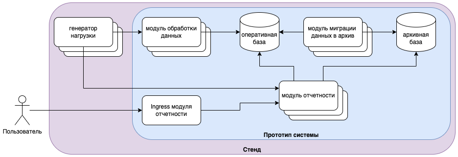

# PostgreSQL and ClickHouse

## Intro

Prototype of a microservice system with OLTP (PostgreSQL) and OLAP (Clickhouse) in one stand.



## Requirements

Requirements for launch:
- linux
- docker
- docker compose

## Build

Launch shell script `mk.sh`

```sh
./mk.sh
```